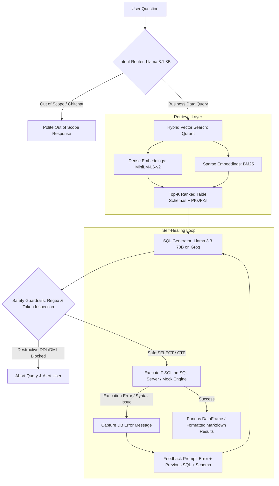

# 🚀 OmniQuery AI — Enterprise Hybrid Text-to-SQL RAG Agent

[](https://www.python.org/)
[](https://groq.com/)
[](https://qdrant.tech/)
[](https://github.com/qdrant/fastembed)
[](LICENSE)

An enterprise-grade **Natural Language to SQL Assistant** designed for complex relational database architectures (Microsoft SQL Server / AdventureWorks). Powered by **Hybrid Vector Search (Qdrant + FastEmbed)**, **Llama 3.3 70B on Groq**, dynamic **Primary/Foreign Key Graph Context Injection**, and an autonomous **Self-Healing Error Correction Loop**.

---

## 💡 The Problem & Architecture

In large enterprise databases (such as AdventureWorks with 90+ tables and hundreds of columns), **dumping the entire database schema into the LLM context window is inefficient, expensive, and leads to severe hallucinations and invalid JOINs**.

**OmniQuery AI** solves this challenge using a **4-Stage Hybrid RAG Pipeline**:



---

## ✨ Key Technical Highlights

1. **Hybrid Schema Indexing (Dense + BM25)**:
   - Indexes pre-computed 1-sentence business summaries, column definitions, and primary/foreign keys into **Qdrant**.
   - Uses `sentence-transformers/all-MiniLM-L6-v2` for semantic meaning and `Qdrant/bm25` for exact column/table name matching.
2. **Relational Context Injection**:
   - Dynamically pulls active foreign key relationships (e.g. `CustomerID -> Sales.Customer(CustomerID)`) so the LLM constructs multi-table `JOIN` statements with 100% accuracy.
3. **Autonomous Self-Healing Loop**:
   - If SQL Server returns a runtime or syntax error (e.g., missing group-by column or invalid join alias), the error message is fed back to the LLM to automatically repair and re-execute the query (up to 3 retries).
4. **Enterprise DDL/DML Guardrails**:
   - Protects against SQL injection and destructive statements (`DROP`, `DELETE`, `TRUNCATE`, `ALTER`, `GRANT`, comments masking) by validating AST tokens and regex patterns before execution.
5. **Zero-Setup Offline Mock Demo Mode**:
   - Enables recruiters, reviewers, and macOS/Linux users to test the assistant immediately without needing a live Microsoft SQL Server instance running locally.

---

## 📂 Repository Structure

```text
omniquery-ai/
├── .env.example              # Documented environment variables template
├── .gitignore                # Git exclusions (caches, DB locks, secrets)
├── config.py                 # Centralized configuration & dynamic DB connection loader
├── main.py                   # Interactive CLI & non-interactive query runner
├── requirements.txt          # Pinned Python dependencies
├── table_descriptions.json   # 93 pre-computed table semantic descriptions
├── LICENSE                   # MIT License
├── ai_engine/
│   ├── __init__.py
│   └── llm.py                # Intent router, T-SQL prompt engineering & self-healing
├── database/
│   ├── __init__.py
│   └── sql_server.py         # Schema extraction, pyodbc execution & safety validator
├── vector_store/
│   ├── __init__.py
│   └── qdrant_db.py          # Qdrant client, Hybrid embedding & retrieval
└── tests/
    ├── __init__.py
    ├── test_intent_router.py # Unit tests for intent classification
    ├── test_sql_generation.py# Unit tests for prompt building & markdown stripping
    └── test_sql_safety.py    # Unit tests for DDL/DML injection guardrails
```

---

## ⚡ Quickstart & Installation

### 1. Clone & Setup Virtual Environment

```bash
git clone https://github.com/mubashir-sohail-dev/omniquery-ai.git
cd omniquery-ai

python -m venv venv
# On Windows:
.\venv\Scripts\activate
# On Linux / macOS:
source venv/bin/activate

pip install -r requirements.txt
```

### 2. Configure Environment Variables

Copy the example file and add your [Groq API Key](https://console.groq.com/keys):

```bash
cp .env.example .env
```

Edit `.env`:
```env
GROQ_API_KEY=gsk_your_actual_groq_api_key_here
FAST_MODEL=llama-3.1-8b-instant
SMART_MODEL=llama-3.3-70b-versatile

# (Optional) If connecting to a live SQL Server instance:
DB_SERVER=localhost\SQLEXPRESS
DB_NAME=AdventureWorks2025
```

---

## 🎮 Running OmniQuery AI

### Option A: Zero-Setup Offline Mock Mode (Recommended for quick testing)
Run the assistant without needing local Microsoft SQL Server:

```bash
python main.py --mock
```

Or pass a single question directly via CLI:
```bash
python main.py --mock --query "Which top 10 products generated the highest revenue?"
```

---

### Option B: Live Microsoft SQL Server Mode
Make sure your SQL Server has the `AdventureWorks` sample database installed and ODBC Driver 18 configured, then run:

```bash
python main.py
```

Force-rebuild the vector index at any time:
```bash
python main.py --rebuild
```

---

## 💬 Sample Query Walkthrough

```text
💬 Ask a data question: What are the top 5 most expensive products and their categories?

🔍 Retrieving relevant schemas via Hybrid Vector Search (Qdrant)...
✅ Retrieved 12 relevant tables: Production.Product, Production.ProductCategory, Production.ProductSubcategory...
🤖 Generating T-SQL with Groq (llama-3.3-70b-versatile)...

============================================================
📝 Generated T-SQL (Attempt 1/3):
============================================================
SELECT TOP 5
    p.Name AS ProductName,
    pc.Name AS CategoryName,
    p.ListPrice
FROM Production.Product p
INNER JOIN Production.ProductSubcategory ps 
    ON p.ProductSubcategoryID = ps.ProductSubcategoryID
INNER JOIN Production.ProductCategory pc 
    ON ps.ProductCategoryID = pc.ProductCategoryID
ORDER BY p.ListPrice DESC;
============================================================

📊 Query Results (5 rows found in 0.84s):
------------------------------------------------------------
| ProductName          | CategoryName | ListPrice |
|:---------------------|:-------------|----------:|
| Road-150 Red, 62     | Bikes        |   3578.27 |
| Road-150 Red, 44     | Bikes        |   3578.27 |
| Road-150 Red, 48     | Bikes        |   3578.27 |
| Road-150 Red, 52     | Bikes        |   3578.27 |
| Road-150 Red, 56     | Bikes        |   3578.27 |
```

---

## 🧪 Running Automated Tests

Run the full test suite with mocked LLM calls (runs instantly with 0 API costs):

```bash
pytest -v
```

---

## 🛡️ License

Distributed under the [MIT License](LICENSE). Built by Mubashir Sohail.
